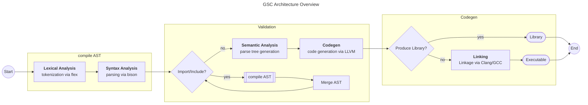

<div align="center">
    
    <br>
    <p>
        Open source programming language compiler based on LLVM, GLib and GNU Bison/Flex
        <br>
        capable of multi target cross compilation powered by simple build system.
    </p>
    <br>
    
    
    
    
    
</div>

## About

Gemstone is a programming language compiler (short: GSC) written in C based on flex and GNU bison.
It uses LLVM to produce optimized native binaries for many platforms and uses its own builtin build system for more complex project management.

## Architecture

Gemstone is a LALR enabled non-reentrant compiler utilizing a linear flow of components. The compiler has multiple stages of operation, each representing a crucial step in compilation.



## Dependencies (build)

### Windows 11

#### MSYS2

Install MSYS2 under Windows 11. Open the MingGW64 environment.
Install the following packages:
```
pacman -S mingw-w64-x86_64-gcc mingw-w64-x86_64-glib2 bison flex mingw-w64-x86_64-llvm cmake git make
```
Clone the repository and build the gemstone compiler:
```
cmake . && make release
```
### GNU/Linux

Requires:
- GCC
- CMake
- Make
- bison
- flex
- LLVM
- Glib 2.0

## Writing Tests

Since the project is build and configured through CMake it makes sense to rely for tests
on CTest. All tests are located in the subfolder `tests`. In this directory is a CMakeLists.txt which specifies which tests
are to be run. Actual tests are located in folders within tests and contain a final CMakeLists.txt which specifies what to run 
for a single test.

```
tests
  └─ test_group1
      └─ CMakeLists.txt  # specify tests in this group
      └─ ...             # test files of group 1
      
  └─ test_group2
      └─ CMakeLists.txt  # specify tests in this group
      └─ ...             # test files of group 2
      
  └─ CMakeLists.txt      # specify test groups to run
  
CMakeLists.txt           # build configuration
```

## Development with VSCode/Codium

Recommended extensions for getting a decent experience are the following:
- https://marketplace.visualstudio.com/items?itemName=llvm-vs-code-extensions.vscode-clangd
- https://marketplace.visualstudio.com/items?itemName=daohong-emilio.yash
- https://marketplace.visualstudio.com/items?itemName=cschlosser.doxdocgen
- https://marketplace.visualstudio.com/items?itemName=ms-vscode.cmake-tools
- https://marketplace.visualstudio.com/items?itemName=twxs.cmake

In order to remove false error messages from clangd CMake has to be run once in order generate compile_commands.json.

## Build
The build pipeline is configured with CMake in the file CMakeLists.txt.
In order to avoid dependency and configuration issues the recommended way to build is by using the provided docker containers.
All tools required for building (`cmake`, `make`, `gcc`, `lex`, `yacc`) are installed inside the SDK container (see Dockerfile sdk/Dockerfile).
For creating the build pipeline build the Dockerfile in the root folder of this repository. This takes the current SDK and copies the source files into the home of the build user.
Then the make targets are generated. Running `make release` will build gemstone from source in release mode.
The generated binaries can be found either in `bin/release/gsc` or `bin/debug/gsc` depending on the chosen target.
The following graph visualizes the build pipeline:
```
                 SDK (environment)
                  │
                  │ configure build environment
                  │  cmake, make, gcc, yacc, lex
                  │
                  ▼
                 Devkit (pipeline)
                  │
                  │ create build pipeline
                  │  create make targets
                  ▼
                 Pipeline
     

yacc (generate files)    GCC (compile)   Extra Source Files (src/*.c)
│                             │                     │
├─ parser.tab.h ─────────────►│◄────────────────────┘
│                             │
└─ parser.tab.c ─────────────►│
                              │
lex (generate file)           │
│                             │
└─ lexer.ll.c  ──────────────►│
                              │
                              ▼
                             gsc
```

## Docker images
Currently, the SDK is based on Almalinux 9.3, an open source distro binary compatible to RHEL 9.3.

The following images can be found in the offical repository at [Docker Hub](https://hub.docker.com/r/servostar/gemstone):
- SDK
- Devkit
